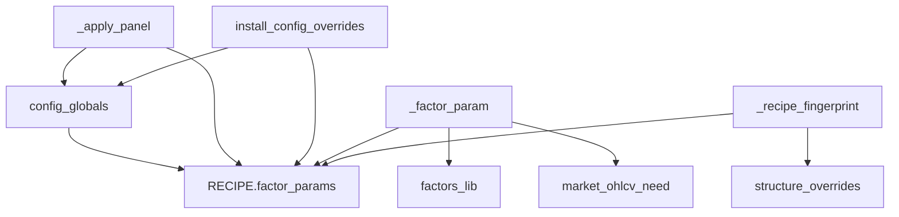

# HlBand factor_params 一次落地

真源仍是 [hongli_band/scripts/qmt/hlband/config.py](hongli_band/scripts/qmt/hlband/config.py) 上部常量；`RECIPE["factor_params"]` 用这些**名字**填满（不要再抄一遍 `0.05`）。常量留下当面板 / 网格 / init 日志别名。不改 [.cursor/plans/hlband_recipe落地_2f1ae76b.plan.md](.cursor/plans/hlband_recipe落地_2f1ae76b.plan.md)，不上提 `qmt_common`，禁止手改 `qmt_terminal_*.py`。



## 优先级与映射

```text
ctx["params"][fid][key] > RECIPE["factor_params"][fid][key] > 同名全局
```

用 `key in block`，禁止 `x or default`。关条语义跟现网，不要写错：

- `time_force.bars<=0`：关掉整条 time_force
- `pullback_vol.confirm_days<=0` 与 `weekly_bear_confirm.days<=0`：现网 `_vol_pullback_confirm_need` / `_w_bear_confirm_need` 都是 `max(1, n)`，**变成「当天即确认」**，不是关因子

映射表 `_FACTOR_PARAM_KEYS` 放 [hongli_band/scripts/qmt/hlband/config.py](hongli_band/scripts/qmt/hlband/config.py)（`MODULE_ORDER` 最先拼；`grid_spec._load_config_ns()` 只 exec config，能读到同一份）。解析/双写函数仍在 [ctx.py](hongli_band/scripts/qmt/hlband/factors/ctx.py)：`_factor_param`、`_factor_params_apply_global`。`grid_spec` / `slots` **只拷指纹折进算法**（FNV 已是两份），不要再拷第三份映射。

| 全局 | 表路径 |
| :--- | :--- |
| `CHASE_MAX_PCT` | `chase.max_pct` |
| `VOL_DRY_RATIO` / `VOL_DRY_N` | `vol_dry.ratio` / `n` |
| `MA_TOUCH_TOL` `VOL_PULLBACK_*` | `pullback_vol.tol` / `vol_n` / `ratio` / `confirm_days` |
| `W_BIAS_HARD` | `w_bias.hard` |
| `W_BIAS_LOW` `W_MA30_SLOPE_WEEKS` | `w_slope.low` / `slope_weeks` |
| `W_BEAR_CONFIRM_DAYS` | `weekly_bear_confirm.days` |
| `SCALE_PLAT_LOOKBACK` `MAX_RANGE` `BREAK_BUF` | `plat_break.*`（`break_buf` 缺省 `0.0`） |
| `SCALE_W_HIST_EXPAND_RATIO` | `w_macd_golden.hist_expand` |
| `STOP_LOSS` | `stop_loss.pct` |
| `TRAIL_TIERS` | `trail_stop.tiers`（**list of lists**，勿留 tuple） |
| `TIME_FORCE_BARS` | `time_force.bars` |

不进表：`D_MA_*` / `W_MA_*` / `MACD_*`（structure / 暖机）、`SCALE_ARM` 等仓位门槛。不做每槽别名。

## 双写（表一填满就必须做）

叶子改读表后，只改全局会失效。

- [hongli_band/scripts/qmt/hlband/runtime.py](hongli_band/scripts/qmt/hlband/runtime.py) `_apply_panel`：现有 `g[const]=new` 之后，映射内的键再写入 `RECIPE["factor_params"]`。`PANEL_BINDS` 仍绑 `W_BIAS_HARD` / `CHASE_MAX_PCT` / `STOP_LOSS`，不上屏 AST。
- [hongli_band/scripts/local_bt/run.py](hongli_band/scripts/local_bt/run.py) `apply_config_overrides`：设完 `ns[key]` 后调 `_factor_params_apply_global`。若 override 带整段 `factor_params`，按 id **再按 key** 合并，不要 `fp[fid]=incoming` 整块替换丢掉同叶子其它键。

无 ctx 的辅助也走解析器（`ctx=None` → 表+全局）：`_vol_pullback_confirm_need`、`_w_bear_confirm_need`、`_trail_arm` / `_trail_tier_params` / `_time_force_hit`、[hongli_band/scripts/qmt/hlband/market.py](hongli_band/scripts/qmt/hlband/market.py) 暖机窗口。组日/周特征时 `VOL_PULLBACK_N` / `VOL_DRY_N` / `confirm_days` / `slope_weeks` 必须和叶子同一把尺子。

## 叶子

[hongli_band/scripts/qmt/hlband/factors/lib/](hongli_band/scripts/qmt/hlband/factors/lib/) 全部去掉裸全局阈值：`chase` `vol_dry` `pullback_vol` `w_bias` `w_slope` `weekly_bear_confirm` `plat_break` `w_macd_golden` `stop_loss` `trail_stop` `time_force`。`weekly_bear` 无阈值可不动。`D_MA_SLOW` 在 `time_force` 里第一期仍读全局。

**不要**把整表快照写进 `ctx["params"]`。默认叶子走 `RECIPE["factor_params"]`；`ctx["params"]` 只给单测/临时覆写。否则浅拷贝会串改 RECIPE，且「先组 ctx 再改表」的测试会读到旧快照。

[test_time_force.py](hongli_band/scripts/local_bt/test_time_force.py) 只 exec `indicators/*` + `trail_stop` + `time_force`，**没有 ctx.py**。叶子改读 `_factor_param` 后必须在 `_load_tf_ns` 里先 exec `factors/ctx.py`，并给空 `RECIPE={"factor_params": {}}`，才能回落到 ns 里的 `TIME_FORCE_BARS` / `TRAIL_TIERS`。

`runtime._trail_tiers_json` / init 的 `stop=` `chase<` 仍读全局；双写后与表一致。只改表、不 sync 全局的单测不要去对 init 日志。

## 指纹（不改会红）

今天探针最后打 `fp(overrides)`，`grid_spec.recipe_fingerprint(overrides=ov)` 用文件表 + overrides 袋。表被 sync 成 `0.03` 后再和袋里的 `CHASE_MAX_PCT=0.03` 一起哈希，会对不上文件表 `0.05` + 袋。

两边改成同一算法（FNV 不变）：

1. 深拷贝 `factor_params`
2. 映射内的 override **折进拷贝**（写两次同一值须幂等）
3. 折 `TRAIL_TIERS` 时先规范成 list of lists（`json.dumps(..., default=str)` 会把 tuple 打成 `"()"` 字符串，两边哈希会分叉）
4. 映射外的结构键（`D_MA_*` `W_MA_*` `MACD_*`）留在 `overrides` 袋
5. 已折进表的键不要再进袋

改 [hongli_band/scripts/qmt/hlband/factors/slots.py](hongli_band/scripts/qmt/hlband/factors/slots.py) 与 [hongli_band/scripts/local_bt/grid_spec.py](hongli_band/scripts/local_bt/grid_spec.py)。空覆盖的 `recipe=` 会变，属预期；`run_init_probe({"CHASE_MAX_PCT": 0.03})` 仍须等于 `recipe_fingerprint(overrides=...)`。

## 测试与文档

在 [hongli_band/scripts/local_bt/test_factor_expr.py](hongli_band/scripts/local_bt/test_factor_expr.py) 先写再改叶子：

- 默认表与常量相等；chase 5% 卡点不变
- 只改表（全局仍 0.05）→ 尺子变
- `_factor_params_apply_global("CHASE_MAX_PCT", 0.03)` 后表和叶子都变
- `time_force.bars=0` 关条；`weekly_bear_confirm.days=1`（或 0→现网 clamp 成 1）当天确认；只改 `pullback_vol.vol_n` 时 ctx 量均窗口跟变

回归：`test_recipe_baseline` `test_intent` `test_time_force` `test_grid_spec` `GridInitProbeTest`。默认回放成交不变。

更新 [hongli_band/scripts/qmt/hlband/factors/NAV.md](hongli_band/scripts/qmt/hlband/factors/NAV.md)、[lib/NAV.md](hongli_band/scripts/qmt/hlband/factors/lib/NAV.md)、config 注释。不改 `panel.xml`。

改完：`python hongli_band/scripts/qmt/_deploy_qmt_gbk.py` 且 compile 成功。

## 明确不做

- 删 `CHASE_MAX_PCT` 等全局名
- 每槽别名、`structure`/`sizing` 分栏
- 全因子 `2^n` 开关、AST 上屏
- 改 `qmt_common` / pending / 买卖语义
- 改 [架构.md](hongli_band/docs/架构重构/架构.md) / Recipe分类（NAV + config 注释够用）

## Review 结论（已回写上面）

方向对，两期并做必须双写 + 改指纹，否则面板/网格/探针必炸。原计划有三处会写错实现：

1. `confirm_days=0` / `days=0` 不是关因子，现网 clamp 成 1
2. `ctx["params"]` 整表快照会浅拷贝串改、测试读旧值
3. `test_time_force` 不加载 ctx，叶子一改就 NameError

另外：映射放 config 避免 `grid_spec` 第三份拷贝；`TRAIL_TIERS` 折进指纹必须 list 化。基线 0 成交仍是弱门，本轮靠 eval / 探针，不重冻 CSV。
