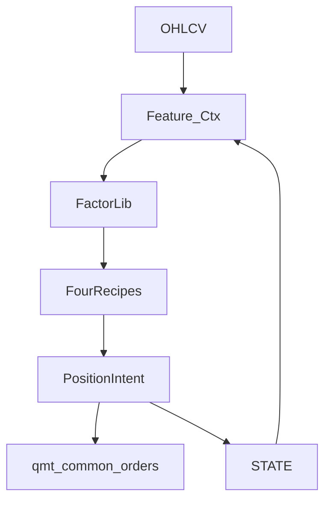

# HlBand Factor Lib + Recipe 落地

依据 [hongli_band/docs/架构优化.md](hongli_band/docs/架构优化.md)、[Recipe分类.md](hongli_band/docs/Recipe分类.md)。范围按你选的 **full stack**：引擎 + 默认 Recipe 行为对齐 + 网格 overrides Recipe + 减仓槽动作 + 仓位仲裁收口。

不改 `qmt_common`、不下单逻辑复制、不手改 `qmt_terminal_hlband.py`。片段禁止互相 `import`，靠 [hongli_band/scripts/qmt/_deploy_qmt_gbk.py](hongli_band/scripts/qmt/_deploy_qmt_gbk.py) 的 `MODULE_ORDER` 拼接（`resolve_fragment` 已支持 `factors/xxx.py`）。



默认 Recipe 与现网等价，故 **现网成交应不变**；减仓仅在 `RECIPE_SCALE_OUT` 非空时才会出 Intent。

**Review 已并入下文**（加仓闸门、`expr` dtype、金标回归、`time_force` 写回、Intent 与 `sell_all`）。

---

## 0. 硬约定（实现时不偏离）

- 叶子 = 现网 **复合原子**（`pullback_vol`、`chase`、`trail_stop`…），不拆 `near_ma & vol_shrink`。
- `eval(ctx)` 只读；`ctx = {market, state, clock}`。streak / `time_force_trend_skip` 在 eval **之前或之后**由运行时写回，不在 `eval` 内改 `A.*`。
- 入场/闸门：票级 `state.position`；出场/减仓：按 lot 填 `state.lot`。
- `scale_once` / `book_lot_cap` / 现金 / `SCALE_ARM*` 留仓位层，不进布尔式。
- 出场仍是 **有序列表**（对齐 stop → trail → time_force，另 `weekly_bear` 全平），不是硬改成单棵 `A&(B|C)` 而改变 reason 优先级。
- 减仓动作复用现有 `pending_exit + lot_ids`（关掉部分笔 = 减仓）；**默认不拆单笔零股**。单笔持仓时减仓命中 → 不减（打日志）。
- `weekly_bear` **叶子 = 当日周空电平**（禁开/撤买即时）；**全平**仍用 streak 确认后的 `force_empty`，二者不要合成一个原子。
- `time_force` 武装让路：`eval` 只返回「不强平」；`time_force_trend_skip` 的写回 + 日志放在 **eval 之后的 hook**（现网在 `_time_force_hit` 内写，拆开后必须等价，否则日志/state 不一致）。
- 本期 **不改** `_ohlcv_need_*`（仍按现常量汇总暖机）。
- `_hit` 遇到 `not` 失败时，reason 映射到现网码：`chase`→`chase_skip`，`vol_dry`→`vol_dry_skip`，`w_bias`→`w_bias_skip`，`w_slope`→`w_slope_skip`。

---

## 1. 新增片段与 MODULE_ORDER

在 [hongli_band/scripts/qmt/hlband/](hongli_band/scripts/qmt/hlband/) 增加（concat 全局命名空间）：

- `factors/registry.py`：`FACTORS`、`_register_factor`
- `factors/ctx.py`：`_build_factor_ctx`（market 特征 + 持仓/lot 快照 + clock）
- `factors/expr.py`：`_hit(expr, ctx)`（`and`/`or`/`not`/叶子）
- `factors/slots.py`：评四槽；出场走 `RECIPE_EXITS` 有序列表（首个 hit 的 reason）
- 复合原子 **按文件合并**（避免 12 条 MODULE_ORDER）：`factors/entry.py`（chase/vol_dry/w_bias/w_slope/weekly_bear 电平/pullback_vol）、`factors/scale.py`（plat_break/w_macd_golden）、`factors/exit.py`（stop_loss/trail_stop/time_force）。registry/ctx/expr/slots 仍独立。

`MODULE_ORDER`：`indicators.py` **之后**、`strategy.py` **之前**（ctx 用 `_price_ma`；不依赖 `market.py` 拉数）。建议放在 `budget.py` 与 `strategy.py` 之间，Intent 不调用 budget。

[config.py](hongli_band/scripts/qmt/hlband/config.py) 增加 Recipe 常量。空列表 = 槽关闭（`RECIPE_SCALE_OUT` 不要用 `False`，否则网格 dtype 在 bool/list 间跳）：

```python
RECIPE_ENTRY = ["and", ["not","chase"], ["not","vol_dry"],
                ["not","w_bias"], ["not","w_slope"],
                ["not","weekly_bear"], "pullback_vol"]
RECIPE_EXITS = ["stop_loss", "trail_stop", "time_force"]  # 有序；按 lot 评
# 加仓信号 OR，且现网同样挡周空/乖离/斜率/无量（chase 不挡 plat_break/金叉）
RECIPE_SCALE_IN = ["and",
    ["not","weekly_bear"], ["not","w_bias"], ["not","w_slope"], ["not","vol_dry"],
    ["or", "pullback_vol", "plat_break", "w_macd_golden"]]
RECIPE_SCALE_OUT = []  # 关闭
RECIPE_EXIT_WEEKLY_BEAR = True  # streak 确认全平，优先于 RECIPE_EXITS
```

`_scale_gate`（ARM/天数/once/满槽）仍在仓位层，不写进 `RECIPE_SCALE_IN`。

`weekly_bear` 清仓保持独立步骤，避免与按笔出场混成「全平 vs 子集 lot」。

---

## 2. 把现逻辑搬进复合原子（行为锁死）

从 [strategy.py](hongli_band/scripts/qmt/hlband/strategy.py) **搬**（不要双份实现）：

| 原子 | 来源 |
| :--- | :--- |
| `pullback_vol` / `chase` / `vol_dry` | `_eval_daily_buy` 拆开后仍产出同一 reason 码（闸门 reason 保持 `chase_skip` 等，叶子 id 与 reason 映射写在 registry） |
| `w_bias` / `w_slope` | `_weekly_bias_guard` / `_weekly_low_slope_guard` |
| `weekly_bear` 电平 | `_eval_weekly` 的 bear；streak 仍 `_update_w_bear_streak` 在组 ctx **前**更新 |
| `plat_break` / `w_macd_golden` | `_daily_plat_break` / 现加仓 MACD 判定 |
| `stop_loss` / `trail_stop` / `time_force` | `_eval_lot_sell` 三条 |

`_handle` 改为：

1. 拉 OHLCV、更新峰值/持仓日/除权（现逻辑保留）
2. 更新 w_bear streak（写 state）
3. `_build_factor_ctx`：**周线 detail / 日线均量只算一次**，四槽共享
4. 评 `entry` / `scale_in` / 按 lot 评 `RECIPE_EXITS` / `scale_out`
5. `time_force` hook：若武装让路则写 `trend_skip`（与现 `_time_force_hit` 副作用对齐）
6. `_resolve_intent` → strategy 写 pending（Intent **不**直接 `passorder`）

日志 `_BUY_LABELS` / `_SELL_LABELS` 继续用同一 reason 字符串。

`pullback_vol` 原子 **不含 chase**（从 `_eval_daily_buy` 拆出）。入场靠 Recipe 的 `not chase`；加仓的 `plat_break`/`w_macd_golden` 现网本就不受 chase 限制。

---

## 3. 仓位仲裁收口

`_resolve_intent` 放在 [strategy.py](hongli_band/scripts/qmt/hlband/strategy.py)（或紧邻的 `factors/intent.py` 只返回 dict）：**纯数据，不写 pending、不碰 budget**。

优先级：**weekly_bear 全平 > RECIPE 出场（按笔）> 减仓 > 加仓（再过 `_scale_gate`）> 入场**。

映射：

- 全平：`pending_exit` 不带/带全部 `lot_ids`，`sell_all=True`（现 weekly_bear 路径）
- 按笔出场：`lot_ids` = 命中出场式的 lots；`sell_all=False`
- 减仓：`target=reduce`，`lot_ids` 为 `SCALE_OUT_LOT`（`last|first`，默认 `last`）选出的 **1 笔**；必须 `sell_all=False`，走 `_sell_fracs_from_exit` 的子集逻辑，禁止误用 weekly_bear 全平
- 加仓/开仓：现 `pending_entry` + `add`
- `skip_sell_eval` 当日：Intent 强制无卖/无减

`_handle` 后半段只消费 Intent，不再散落 `if stop_hit elif trail...`。

---

## 4. 减仓槽（默认关）

- `RECIPE_SCALE_OUT == []` → 永不 hit，回归现网。
- 启用后：表达式为真且持仓 ≥2 笔 → 按 `SCALE_OUT_LOT` 选 1 笔进入 `lot_ids`；与「出场全平」冲突时做出场。
- 单测：表达式 false 时零减仓；true 且 2 笔时只平指定笔。
- **不做**：新网格大扫减仓、实盘默认开启、单笔零股减仓。

---

## 5. 网格 / 探针认 Recipe

- [grid_spec.py](hongli_band/scripts/local_bt/grid_spec.py) **必须手写 `expr` dtype**：`_dtype_for` 对嵌套 list 会落到 `float`（非数值 tuple、非 bool）。`RECIPE_ENTRY` / `RECIPE_EXITS` / `RECIPE_SCALE_IN` / `RECIPE_SCALE_OUT` 走 JSON 解析/序列化，不要进百分数扫描框。
- `GROUP_ORDER` 增加「配方」；`PARAM_LABELS` / `ABBREV_FIXED` 补四键。
- [grid_ui.py](hongli_band/scripts/local_bt/grid_ui.py) 扫描值：`expr` 用 JSON 文本（每格一行或一块 JSON），禁止按逗号切 float。
- [runtime.py](hongli_band/scripts/qmt/hlband/runtime.py) init 指纹 `recipe=`（四槽 compact JSON 或短哈希）；[grid_run.py](hongli_band/scripts/local_bt/grid_run.py) 仅当格子 override 了 `RECIPE_*` 时核对该串（数值-only 格子不强制）。
- 现有数值轴不变。不在本期做全因子 `2^n`，也不做 Recipe 笛卡尔积 UI 默认全开。
- 文档补一句：组合轴 = 命名格子改 `RECIPE_*`。

---

## 6. 测试与验收

必跑：

- 搬迁后修 [test_time_force.py](hongli_band/scripts/local_bt/test_time_force.py)（现按 `strategy.py` 函数切片 `exec`；改为加载 `factors` 片段或保留同名包装函数）
- `test_ex_rights` / `test_book_backtest` / `test_odd_lot_remain` 等与成交相关的 local_bt 单测
- 新增：`test_factor_expr.py`（and/or/not、缺叶子、`not`→现网 skip 码）；减仓 `[]` / 非空各一例
- **不要**「默认 Recipe vs 旧 `_eval_*` 双份对照」——搬走后旧分支不存在。行为锁用 **重构前 book 成交金标**（现 `test_book_backtest` / 固定 CSV 操作明细：日、reason、笔数）
- `python hongli_band/scripts/qmt/_deploy_qmt_gbk.py` 且 preview `compile` 成功

不改主题 `config` 里的交易阈值；`DRY_RUN` 保持现状。默认不 deploy 到实盘语义变化——仅拼接产物更新。

---

## 7. 明确不做（本期）

- 细原子拆分、QMT 热加载插件、panel 上屏 Recipe
- 改 `budget.py` 资金公式、改 `qmt_common`
- 用减仓替代 `trail_stop` 语义
- 把 `SCALE_ARM` 写进加仓布尔式

---

## 建议提交切分（仍属同一计划）

1. 注册表 + `hit` + 复合原子 + `_handle` 改走引擎（减仓恒 false）+ 回归绿  
2. `_resolve_intent` 收口 + 减仓动作（默认关）  
3. `RECIPE_*` 入网格 overrides + `recipe=` 探针  
4. deploy + 文档把「已实现」与草图对齐（只改 docs 已有两篇的落地勾选，不新写长文）
