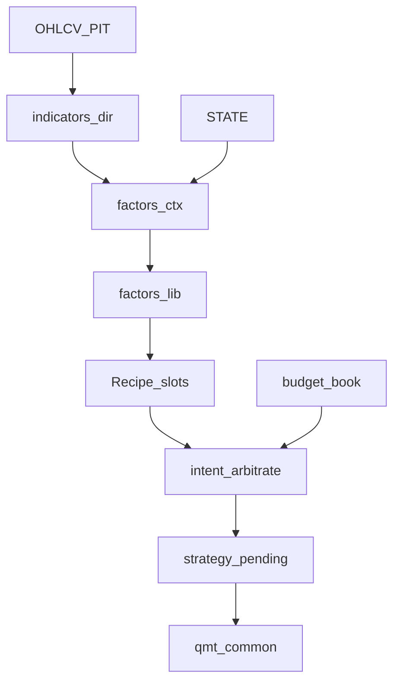

# HlBand 架构落地计划

真源：[docs/架构重构/架构.md](hongli_band/docs/架构重构/架构.md)、[Recipe分类.md](hongli_band/docs/架构重构/Recipe分类.md)。

约束（违反即错）：片段禁止互 `import`，只改 [hlband/](hongli_band/scripts/qmt/hlband/) + [_deploy_qmt_gbk.py](hongli_band/scripts/qmt/_deploy_qmt_gbk.py)；禁止手改 `qmt_terminal_*.py`；每步后 `python hongli_band/scripts/qmt/_deploy_qmt_gbk.py` 且 `compile` 成功。local_bt 已按 deploy 的 `MODULE_ORDER` 拼包（[run.py](hongli_band/scripts/local_bt/run.py)），改顺序即生效。

本轮**不上提** `qmt_common`（指标/引擎以后再迁）。**不改买卖语义**；减仓槽恒 `false`，只留类型。



---

## 第 1 步：指标目录（无语义变化）

把 [indicators.py](hongli_band/scripts/qmt/hlband/indicators.py) 拆成一指标一文件，删掉单文件以免和目录重名。

| 新文件 | 内容 |
| :--- | :--- |
| `indicators/sma.py` | `_sma` |
| `indicators/ema.py` | `_ema` |
| `indicators/macd.py` | `_calc_macd` |
| `indicators/util.py` | `_last_valid`；从 strategy 挪 `_cross_up` / `_cross_down` |
| `indicators/price_ma.py` | `_ma_kind` / `_price_ma`（读 `BOOK_STOCKS`） |

`_near_ma` / `_plat_window` **不进**指标目录，第 2 步进对应 `factors/lib`。本步不加 `atr.py`（现网未用）。

`MODULE_ORDER`：把 `"indicators.py"` 换成 `util → sma → ema → macd → price_ma`（macd 必须在 ema 之后）。

同步改 [test_time_force.py](hongli_band/scripts/local_bt/test_time_force.py) 的 `INDICATORS_PATH`（现写死 `indicators.py`）。`analyze.py` 里自备的 SMA/EMA 副本本步不动。

**验收**：deploy `compile`；现有 local_bt 单测全过。

---

## 第 2 步：因子库 + 默认 Recipe（对齐现网）

从 [_handle_stock](hongli_band/scripts/qmt/hlband/strategy.py) / `_eval_*` 抽出叶子，阈值仍读 [config.py](hongli_band/scripts/qmt/hlband/config.py) 全局（`CHASE_MAX_PCT` 等），**不写死在叶子里**。

引擎（根目录）：

- `factors/ctx.py`：组 `ctx = {market, state, clock}`；峰值/持仓日/除权在进因子前由现有逻辑更新
- `factors/registry.py`：`id → eval`
- `factors/expr.py`：`hit(and/or/not)`
- `factors/slots.py`：评四槽 → `{hit, reasons, detail}`

叶子（`factors/lib/<id>.py`，一 id 一文件）：

`pullback_vol` `chase` `vol_dry` `w_bias` `w_slope` `weekly_bear` `plat_break` `w_macd_golden` `stop_loss` `trail_stop` `time_force`

默认 `RECIPE` **本步就写入 config**（第 4 步只加指纹，不另起一份）。表达式无数字。

**必须按现网不对称闸门写，不能四槽套同一套 ¬chase：**

- `entry`：`¬chase ∧ ¬vol_dry ∧ ¬w_bias ∧ ¬w_slope ∧ ¬weekly_bear ∧ pullback_vol`
- `scale_in`：`¬vol_dry ∧ ¬w_bias ∧ ¬w_slope ∧ ¬weekly_bear ∧ ( (pullback_vol ∧ ¬chase) ∨ plat_break ∨ w_macd_golden )`  
  门槛 `SCALE_ARM` / `scale_once` / 满槽仍在 `_scale_gate`，不进表达式  
  现网：破平台/金叉**不受** `chase`；回踩加仓受；`vol_dry`/周线闸门对加仓同样生效
- `exit`：有序列表。`weekly_bear` **确认清仓**不是「当天空头」——用独立叶子 `weekly_bear_confirm`（读 streak），或槽外在 streak 满后再 OR。禁止和入场共用同一个 `eval=当天空头` 的 `weekly_bear`
- `scale_out`：`false`（第 5 步不另做功能）

注意：

- `weekly_bear` 叶子 = 当天空头（禁开/撤买）；`_update_w_bear_streak` **不进** `eval`
- `_eval_weekly`：MA/MACD 进 `ctx.market`；空头/金叉进叶子。`weekly_bull` 仅日志，不成因子
- 叶子 id 用 `chase`；日志码 `chase_skip` 由 strategy 映射
- 不要拿整段 `_eval_daily_buy` 当 AST 对照（它把 chase/vol_dry/回踩揉在一起且提前 return）。对照对象是 `_handle_stock` 里的 `buy_sig` / `scale_sig` / `sell_reasons`

第 2 步**之前**冻结一条 local_bt 基线（成交 CSV / reason / 期末仓）。`_handle_stock` 改为组 ctx → `slots` → 仍走现有打卡/挂 pending。本步不引入 Intent。

`test_time_force.py` 从 `strategy.py` 切片 `_trail_arm`..`_lot_from_agg`：叶子迁走后改切 `factors/lib/time_force.py`。

**验收**：基线回放买卖笔数 / reason / 期末仓一致。`test_factor_expr` 测 AST 求值与「当天空头 vs 确认」两套 weekly_bear。

---

## 第 3 步：仓位仲裁收口

新增 `factors/intent.py`，输入四槽结果 + `_scale_gate` + 卖点 lot_ids，输出：

```text
{ side, target: open|add|flat|reduce, lot_ids?, frac?, reasons[] }
```

优先级写死（本步不开放覆写）：`flat > reduce > add > open`。`reduce` 本步不会产生。

时钟、confirm/exec、`_try_exec_pending_*` **留在 strategy**，不要 Intent 化。

[budget.py](hongli_band/scripts/qmt/hlband/budget.py) 账本 / 50·30·剩余 / 打卡**不搬**。strategy 只根据 Intent 写新的 `pending_entry` / `pending_exit`；`_pending_on_*`、`qmt_common` 订单不动。

现网已有「执行日有卖则取消加仓」「加仓当日 skip 评卖」留在本层，不算因子。

**验收**：有卖+有加仓的日子仍只出卖；`scale_once` / `book_lot_cap` 行为不变。

---

## 第 4 步：config / 网格认 Recipe

`RECIPE` 已在第 2 步进 config。本步只做：网格/探针 `recipe=` 哈希（表达式 + 被覆盖的阈值键）。`factor_params` 可空，格子继续 override `CHASE_MAX_PCT` 等现有常量。不把 AST 暴露到 `panel.xml`。

[grid_spec.py](hongli_band/scripts/local_bt/grid_spec.py) / 探针：增加 `recipe=` 哈希（表达式 + 启用因子阈值）。禁止全因子 `2^n` 开关笛卡尔积；组合轴仍是少量命名变体。

**验收**：默认 Recipe 网格/回放与第 3 步一致；日志或指纹能打出 `recipe=`。

---

## 第 5 步：减仓槽接口（不实现）

`scale_out` 槽保留，求值恒 `false`。Intent 的 `target` 含 `reduce`，strategy 对 `reduce` 走「未实现则忽略」或断言不应出现。不加按比例/按笔减仓，不改卖出 pending 形态。

**验收**：默认回放零减仓单；文档注明减仓未启用。

---

## 明确不做

- 不抽 `qmt_common/indicators` 或 common 因子引擎（避免全策略 re-deploy）
- 不改 pending / T+1 / PIT / lots 实现
- 不拆 `pullback_vol` 为 `near_ma & vol_shrink`
- 不重排文档目录（架构稿已够用）

---

## 建议提交节奏

每步一次 deploy + 一组回归后再下一步。第 1 步可单独合；第 2 步是行为对齐的关键门（含 `scale_out=false`）；第 3–4 步回归绿可同批；第 5 步只做核对，不新开功能。
