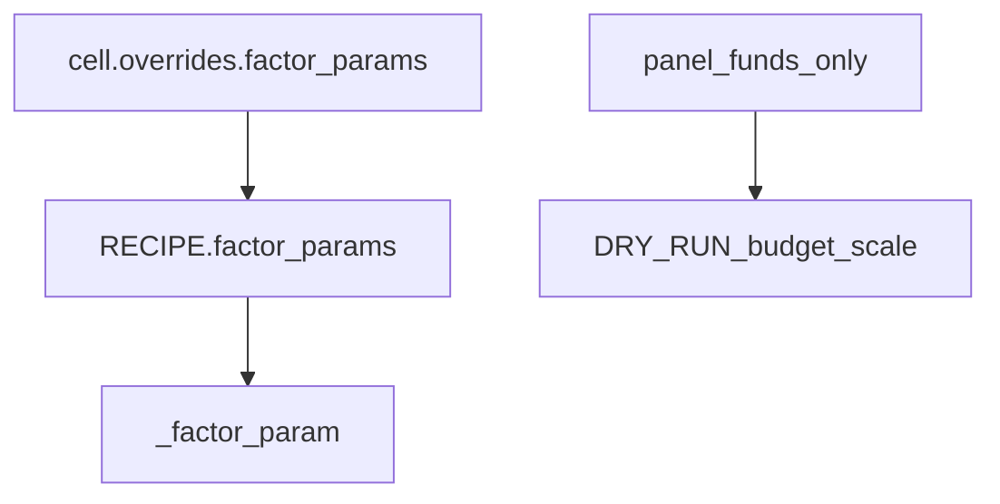

# 删全局因子键（表为真源）

硬切，不兼容 `{"STOP_LOSS": 0.06}`。不改 [.cursor/plans/factor_params接线_f9eb63c9.plan.md](.cursor/plans/factor_params接线_f9eb63c9.plan.md)、不上提 `qmt_common`、禁止手改 `qmt_terminal_*.py`。



## 删哪些名字

从 [config.py](hongli_band/scripts/qmt/hlband/config.py) **删除赋值和 `_FACTOR_PARAM_KEYS`**：

`CHASE_MAX_PCT` `W_BIAS_HARD` `W_BIAS_LOW` `W_MA30_SLOPE_WEEKS` `MA_TOUCH_TOL` `VOL_PULLBACK_*` `VOL_DRY_*` `TRAIL_TIERS` `TIME_FORCE_BARS` `STOP_LOSS` `W_BEAR_CONFIRM_DAYS` `SCALE_PLAT_LOOKBACK` `SCALE_PLAT_MAX_RANGE` `SCALE_W_HIST_EXPAND_RATIO`

`RECIPE["factor_params"]` 改成**字面量**（`chase.max_pct: 0.05`，`time_force.bars: 30`，`trail_stop.tiers` 为 list of lists）。注释迁到表上。

**留下**：`D_MA_*` `W_MA_FAST` `W_MA_LIFE` `MACD_*`；`SCALE_ARM` / `SCALE_ENABLE` / 资金 / 路径 / 时钟。

## 读参 / 覆盖

[ctx.py](hongli_band/scripts/qmt/hlband/factors/ctx.py) `_factor_param`：只 `ctx["params"] > RECIPE["factor_params"]`，**禁止**再读同名全局。缺键用**数字字面量**缺省（如 lookback `20`、vol_n `10`），不要写 `int(VOL_PULLBACK_N if raw is None …)`——那个名字删掉后是 `NameError`。[market.py](hongli_band/scripts/qmt/hlband/market.py) 暖机、[time_force.py](hongli_band/scripts/qmt/hlband/factors/lib/time_force.py) 里 `globals().get("TRAIL_TIERS")` 兜底一并删。

`_factor_params_apply_global` 只接受整段 `factor_params`（按 id 再按 key 合并）。

[run.py](hongli_band/scripts/local_bt/run.py) `apply_config_overrides`：

- `factor_params` → 合并进表
- `D_MA_*` / 资金等仍写 `ns[key]`
- 顶层出现已删因子键 → **立刻报错**（不折进表）

[run.py](hongli_band/scripts/local_bt/run.py) `_get_ohlcv_1d` 改读 `ns["RECIPE"]["factor_params"]`（`plat_break.lookback`、`pullback_vol.*`、`vol_dry.n`），不要 `ns.get("SCALE_PLAT_LOOKBACK")`。

init 日志 `stop=` `chase<` `time_force_bars=` `scale_plat=` `trail_tiers=` 改读 `_factor_param` / 表。[runtime.py](hongli_band/scripts/qmt/hlband/runtime.py) `_trail_tiers_json` 不要读 `TRAIL_TIERS`。

## 面板

[panel.xml](hongli_band/scripts/qmt/hlband/panel.xml) 与 `PANEL_BINDS` 删掉周线乖离 / 追高 / 硬止损。留下模拟下单、资金、加仓开关。改完 `validate_panel` + `python hongli_band/scripts/qmt/_deploy_qmt_gbk.py`。

## 网格目录（大头）

[grid_spec.py](hongli_band/scripts/local_bt/grid_spec.py) 不再从 config 顶层扫 `STOP_LOSS`。

- 因子轴 id = 点路径：`stop_loss.pct` `chase.max_pct` `trail_stop.tiers` `time_force.bars` …
- `_build_catalog`：从 `RECIPE["factor_params"]` 展开这些路径，再加上仍存在的结构/资金全局（`D_MA_*` `CASH_RATIO` …）
- `ENTRY_KEYS` / `EXIT_KEYS` / `KIND_EXIT_IDS` / `PERCENT_KEYS` / `PARAM_LABELS` / 短 id / `parse_scan` 全部改路径（`stop_loss.pct` 仍按百分数解析 `6`→`0.06`）
- `build_cells({"stop_loss.pct": [0.06, 0.10]})` → 格子 `overrides = {"factor_params": {"stop_loss": {"pct": 0.06}}}`；多轴打进**同一棵** `factor_params`
- [grid_run.py](hongli_band/scripts/local_bt/grid_run.py) `load_config_defaults` 今天是 `getattr(mod, spec.key)`。点路径不是模块属性，必须改成：因子轴从 `RECIPE["factor_params"]` 展平取值，结构/资金仍 `getattr`
- `catalog_override_keys` 必须承认顶层键 `factor_params`（外加资金/结构），否则格子会被当成非法键锁死
- 载入 spec / `apply_config_overrides` 时顶层旧键直接报错
- [grid_ui.py](hongli_band/scripts/local_bt/grid_ui.py) 帮助文案里的 `TRAIL_TIERS`；[robust_run.py](hongli_band/scripts/local_bt/robust_run.py) `need_trail = "TRAIL_TIERS" in overrides` 改成看 `factor_params.trail_stop.tiers`
- [test_grid_spec.py](hongli_band/scripts/local_bt/test_grid_spec.py) 有读 `hongli_band/gridConfig/stop_loss.json`，删文件后改读 skill 示例或夹具

[grid_run.py](hongli_band/scripts/local_bt/grid_run.py) `expected_fingerprint`：

```text
stop = fp["stop_loss"]["pct"]
time_force_bars = fp["time_force"]["bars"]
trail_arm = fp["trail_stop"]["tiers"][0][0]
```

`recipe=`：深合并 overrides.`factor_params` 进表拷贝；`overrides` 袋只留 `D_MA_*` `W_MA_*` `MACD_*`。删掉「`STOP_LOSS` 折进表」那套 `_FACTOR_PARAM_KEYS` 依赖。

[slots.py](hongli_band/scripts/qmt/hlband/factors/slots.py) 指纹同一算法（两份拷贝，与现 FNV 约定一致）。

## 旧 JSON：删除

按你的选择，删除 [hongli_band/gridConfig/](hongli_band/gridConfig/) 下现有 JSON（`stop_loss.json` `entry_*.json` 等），不改写成旧键翻译。目录可留空，UI「保存 spec 到 gridConfig」仍往这里写新格式。

Skill 示例改成新键，避免技能本身不可用：

- [.cursor/skills/qmt-local-bt-grid/examples/stop_loss.json](.cursor/skills/qmt-local-bt-grid/examples/stop_loss.json)
- [stop_loss_space.json](.cursor/skills/qmt-local-bt-grid/examples/stop_loss_space.json)

`overrides` 写成 `{"factor_params": {"stop_loss": {"pct": 0.06}}}`。SKILL.md 里「扫 STOP_LOSS」改成扫 `stop_loss.pct`。

## 测试 / 文档

- [test_time_force.py](hongli_band/scripts/local_bt/test_time_force.py)：空表不能回落全局；`RECIPE.factor_params` 写上 `time_force.bars` / `trail_stop.tiers`
- [test_factor_expr.py](hongli_band/scripts/local_bt/test_factor_expr.py)：默认表与字面量；只改表；`apply` 只测嵌套合并；去掉对 `ns["CHASE_MAX_PCT"]` 的断言
- [test_intent.py](hongli_band/scripts/local_bt/test_intent.py) 探针：`run_init_probe({"factor_params": {"chase": {"max_pct": 0.03}}})`
- [test_grid_spec.py](hongli_band/scripts/local_bt/test_grid_spec.py) / [test_grid_run.py](hongli_band/scripts/local_bt/test_grid_run.py) / [test_grid_summarize.py](hongli_band/scripts/local_bt/test_grid_summarize.py) / [test_robust.py](hongli_band/scripts/local_bt/test_robust.py)：defaults 从 `factor_params` 取；格子 overrides 全换嵌套；断言旧键加载失败
- 回归：`test_recipe_baseline` `GridInitProbeTest`

更新 [model.md](hongli_band/model.md)、[factors/NAV.md](hongli_band/scripts/qmt/hlband/factors/NAV.md)、[lib/NAV.md](hongli_band/scripts/qmt/hlband/factors/lib/NAV.md)。不改架构.md / Recipe分类。

## 明确不做

- 旧键翻译层、保留 `CHASE_MAX_PCT` 别名
- 每槽别名、`structure`/`sizing` 分栏
- AST / 因子阈值上屏
- 改 `qmt_common` / 买卖语义
- 清 `report/grid/` 历史扫参目录（旧 overrides 只是档案，不必本轮迁）

## Review 结论（已回写上面）

方向对，硬切范围也清楚。原计划漏了四条，不补会红或 `NameError`：

1. `load_config_defaults` 用 `getattr(mod, spec.key)`，点路径不是模块属性，必须从 `factor_params` 展平
2. 格子 overrides 的顶层键是 `factor_params`，目录合法键集合必须包含它
3. ctx / market / `time_force` 里仍有 `VOL_PULLBACK_N` / `TRAIL_TIERS` 字面回落，删全局后会炸
4. `grid_ui` / `robust_run` / `test_grid_spec` 读 `gridConfig/stop_loss.json` 要跟着改

`gridConfig/` 删文件、留空目录即可。Skill 示例改新键，旧扫参 report 不迁。
