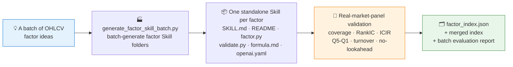
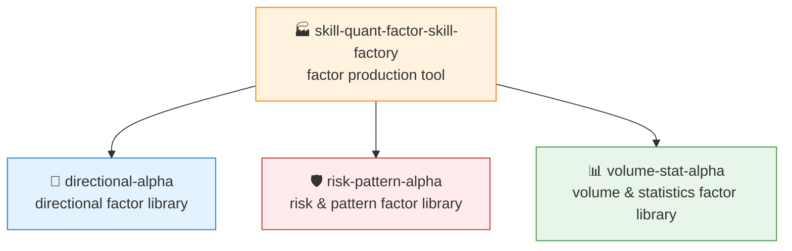

# 🏭 skill-quant-factor-skill-factory

[简体中文](README.md) | **English**

> Not a factor library itself, but the tool that keeps producing them: batch-generate, validate, and package framework-neutral OHLCV quant factor Skills.

<p align="center">
  
  
  
  
  
</p>

`skill-quant-factor-skill-factory` is the factor-production tool Skill provided by the QuantSkills organization. It batch-generates, validates, and packages framework-neutral OHLCV quant factor Skills.

QuantSkills GitHub organization: https://github.com/quantskills

It is not a factor library itself — it is the tool used to keep producing factor libraries. The three factor libraries QuantSkills currently publishes are:

- [`skill-quant-factor-directional-alpha`](https://github.com/quantskills/skill-quant-factor-directional-alpha)
- [`skill-quant-factor-risk-pattern-alpha`](https://github.com/quantskills/skill-quant-factor-risk-pattern-alpha)
- [`skill-quant-factor-volume-stat-alpha`](https://github.com/quantskills/skill-quant-factor-volume-stat-alpha)

## 🎯 What problem does this Skill solve

Use this repository when you want to turn a batch of new OHLCV factor ideas into Skill packages that are installable, verifiable, and callable by AI Agents.

It automatically:

- Batch-generates factor Skill folders
- Generates `SKILL.md`, a user README, formula notes, and Agent metadata for every factor
- Generates a framework-neutral `scripts/factor.py`
- Generates a standalone runnable `scripts/validate.py`
- Computes validation metrics on a real market panel
- Maintains `factor_index.json` and merged indexes
- Produces a batch evaluation report

## ⚡ Production Pipeline



## 🗃️ Input Data Requirements

The target project must provide a real market panel:

```text
real_market_data/
  panels/
    ohlcv_panel.parquet
    panel_manifest.json
```

Market data fields must include at least:

```text
date, symbol, open, high, low, close, volume
```

Recommended additional field:

```text
market
```

## 📦 Generated Factor Structure

Each factor is generated as a standalone Skill:

```text
R1001-example-factor/
  SKILL.md
  README.md
  scripts/
    factor.py
    validate.py
  validation_real/
    result.json
    report.md
  references/
    formula.md
  agents/
    openai.yaml
```

Generated factors can be invoked individually by any agent environment that supports the `SKILL.md` convention.

## 🚀 Quick Start

Run inside the target project:

```powershell
$env:PYTHONUTF8='1'
python .\tools\generate_factor_skill_batch.py `
  --count 200 `
  --start-id 1001 `
  --existing-index .\real_data_factor_skills_all_1000_index.json `
  --output-root .\real_data_factor_skills_extra_200_next `
  --combined-index .\real_data_factor_skills_all_1200_index.json `
  --report-name extra_200_next_factor_evaluation_report.md
```

Arguments:

| Argument | Description |
|---|---|
| `--count` | Number of factors to generate in this batch |
| `--start-id` | Starting ID for this batch |
| `--existing-index` | Existing factor index, used to avoid duplicates |
| `--output-root` | Output directory for this batch |
| `--combined-index` | Merged index produced after generation |
| `--report-name` | Filename of the factor evaluation report |

## 🧪 Validation Metrics

During batch generation, the following metrics are computed for every factor:

- Usable-sample coverage
- 5-day mean Rank IC
- 5-day ICIR
- Quintile Q5-Q1 return spread
- Top-group turnover
- No-lookahead check

Validation results are written to:

```text
validation_real/result.json
validation_real/report.md
```

## 🧭 Relationship to the QuantSkills Factor Libraries

This tool produces and extends the QuantSkills factor libraries. The three public libraries are:



| Repository | Purpose |
|---|---|
| [`skill-quant-factor-directional-alpha`](https://github.com/quantskills/skill-quant-factor-directional-alpha) | Directional factors: trend, momentum, reversal, breakout, channel position |
| [`skill-quant-factor-risk-pattern-alpha`](https://github.com/quantskills/skill-quant-factor-risk-pattern-alpha) | Risk & pattern factors: volatility, candlestick patterns, oscillator states, drawdown pressure |
| [`skill-quant-factor-volume-stat-alpha`](https://github.com/quantskills/skill-quant-factor-volume-stat-alpha) | Volume & statistics factors: volume, price-volume relation, liquidity, time-series rank, return distribution |

If you just want ready-made factors, install the three libraries above.
If you want to keep producing new factors, maintaining indexes, and generating validation reports, use this tool.

## 🔌 Installing into an Agent Environment

Place the repository in your agent's Skills directory. Default directories vary by agent; the common form is:

```text
<AGENT_SKILLS_HOME>/skill-quant-factor-skill-factory
```

If your agent supports explicit Skill invocation via `$skill-name`, you can use:

```text
Use $skill-quant-factor-skill-factory to generate a new QuantSkills factor Skill batch and validate it on cached real market data.
```

If your agent uses a different install directory, just keep the repository structure intact and make sure `SKILL.md` sits at the Skill root.

## 📂 Repository Contents

```text
SKILL.md
README.md
scripts/
  generate_factor_skill_batch.py
references/
  acceptance_checklist.md
agents/
  openai.yaml
```

`scripts/generate_factor_skill_batch.py` is the core batch-generation script.

## 📜 License

This repository is licensed under the GNU General Public License v3.0. See [LICENSE](LICENSE).

Copyright (C) 2026 QuantSkills.

## 🐼 PandaAI / QUANTSKILLS Community

<div align="center">
  
  <br>
  <sub>Scan the QR code to join the PandaAI community for QUANTSKILLS skills, agent workflows, and quantitative research practice.</sub>
</div>
