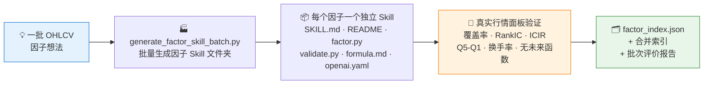
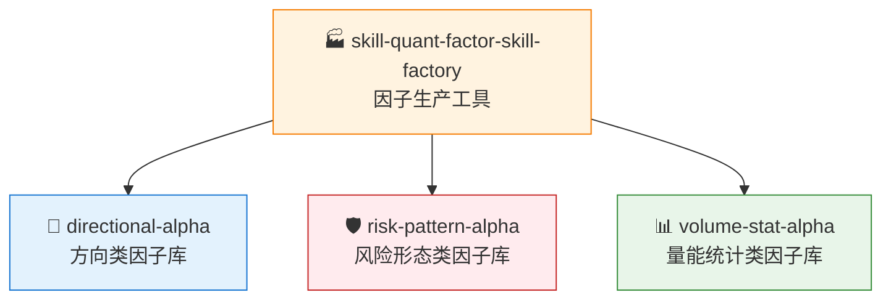

# 🏭 skill-quant-factor-skill-factory

**简体中文** | [English](README.en.md)

> 不是因子库本身，而是继续生产因子库的工具：批量生成、验证和打包框架中立的 OHLCV 量化因子 Skill。

<p align="center">
  
  
  
  
  
</p>

`skill-quant-factor-skill-factory` 是 QuantSkills 组织提供的因子生产工具 Skill。它用于批量生成、验证和打包框架中立的 OHLCV 量化因子 Skill。

QuantSkills GitHub 组织：https://github.com/quantskills

它不是一个因子库本身，而是用于继续生产因子库的工具。QuantSkills 目前公开的三类因子库包括：

- [`skill-quant-factor-directional-alpha`](https://github.com/quantskills/skill-quant-factor-directional-alpha)
- [`skill-quant-factor-risk-pattern-alpha`](https://github.com/quantskills/skill-quant-factor-risk-pattern-alpha)
- [`skill-quant-factor-volume-stat-alpha`](https://github.com/quantskills/skill-quant-factor-volume-stat-alpha)

## 🎯 这个 Skill 解决什么问题

当你想把一组新的 OHLCV 因子想法整理成可安装、可验证、可被 AI Agent 调用的 Skill 包时，可以使用本仓库。

它会自动完成：

- 批量生成因子 Skill 文件夹
- 为每个因子生成 `SKILL.md`、用户 README、公式说明和 Agent 元数据
- 生成框架中立的 `scripts/factor.py`
- 生成可独立运行的 `scripts/validate.py`
- 基于真实行情面板计算验证指标
- 维护 `factor_index.json` 和合并索引
- 生成批次评价报告

## ⚡ 生产流水线



## 🗃️ 输入数据要求

目标工程需要准备真实行情面板：

```text
real_market_data/
  panels/
    ohlcv_panel.parquet
    panel_manifest.json
```

行情字段至少包含：

```text
date, symbol, open, high, low, close, volume
```

推荐额外保留：

```text
market
```

## 📦 生成出来的因子结构

每个因子会生成一个独立 Skill：

```text
R1001-example-factor/
  SKILL.md
  README.md
  scripts/
    factor.py
    validate.py
  validation_real/
    result.json
    report.md
  references/
    formula.md
  agents/
    openai.yaml
```

生成后的因子可以被支持 `SKILL.md` 规范的智能体环境单独调用。

## 🚀 快速开始

在目标工程中运行：

```powershell
$env:PYTHONUTF8='1'
python .\tools\generate_factor_skill_batch.py `
  --count 200 `
  --start-id 1001 `
  --existing-index .\real_data_factor_skills_all_1000_index.json `
  --output-root .\real_data_factor_skills_extra_200_next `
  --combined-index .\real_data_factor_skills_all_1200_index.json `
  --report-name extra_200_next_factor_evaluation_report.md
```

参数说明：

| 参数 | 说明 |
|---|---|
| `--count` | 本批次生成的因子数量 |
| `--start-id` | 本批次起始编号 |
| `--existing-index` | 已有因子索引，用于避免重复 |
| `--output-root` | 本批次输出目录 |
| `--combined-index` | 生成后的合并索引 |
| `--report-name` | 因子评价报告文件名 |

## 🧪 验证指标

批量生成过程中会为每个因子计算：

- 可用样本覆盖率
- 5 日 Rank IC 均值
- 5 日 ICIR
- 五分组 Q5-Q1 收益差
- Top 组换手率
- 无未来函数检查

验证结果会写入：

```text
validation_real/result.json
validation_real/report.md
```

## 🧭 QuantSkills 因子库关系

本工具用于生产和扩展 QuantSkills 因子库。当前三类公开因子库如下：



| 仓库 | 用途 |
|---|---|
| [`skill-quant-factor-directional-alpha`](https://github.com/quantskills/skill-quant-factor-directional-alpha) | 趋势、动量、反转、突破、通道位置等方向类因子 |
| [`skill-quant-factor-risk-pattern-alpha`](https://github.com/quantskills/skill-quant-factor-risk-pattern-alpha) | 波动率、K 线形态、震荡状态、回撤压力等风险形态类因子 |
| [`skill-quant-factor-volume-stat-alpha`](https://github.com/quantskills/skill-quant-factor-volume-stat-alpha) | 成交量、量价关系、流动性、时序排名、收益分布等量能统计类因子 |

如果你只是想使用现成因子，请安装上面三个因子库。
如果你想继续生产新因子、维护索引和生成验证报告，请使用本工具。

## 🔌 安装到智能体环境

将仓库放入你使用的智能体 Skills 目录。不同智能体的默认目录可能不同，常见形式如下：

```text
<AGENT_SKILLS_HOME>/skill-quant-factor-skill-factory
```

如果你的智能体支持通过 `$skill-name` 显式调用 Skill，可以这样使用：

```text
Use $skill-quant-factor-skill-factory to generate a new QuantSkills factor Skill batch and validate it on cached real market data.
```

如果你的智能体使用其他安装目录，只需要保持仓库结构不变，并确保 `SKILL.md` 位于 Skill 根目录即可。

## 📂 仓库内容

```text
SKILL.md
README.md
scripts/
  generate_factor_skill_batch.py
references/
  acceptance_checklist.md
agents/
  openai.yaml
```

其中 `scripts/generate_factor_skill_batch.py` 是核心批量生成脚本。

## 📜 License

This repository is licensed under the GNU General Public License v3.0. See [LICENSE](LICENSE).

Copyright (C) 2026 QuantSkills.

## 🐼 PandaAI / QUANTSKILLS 社群

<div align="center">
  
  <br>
  <sub>扫码加入 PandaAI 社群，交流 QUANTSKILLS 技能、Agent 工作流与量化研究实践。</sub>
</div>
