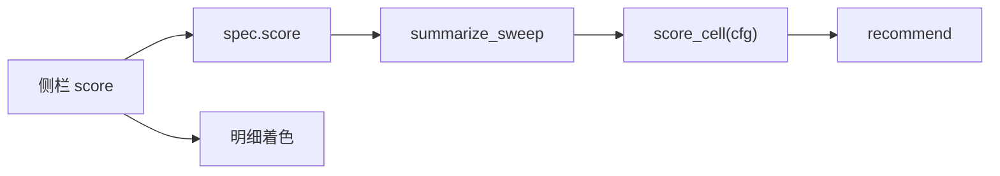

# 网格四维综合分

取消硬门否决。全部格子按四维综合分排序，总分最高即推荐（接近 1.0 分则少改与 config 的差异键）。仅全部无法打分才无推荐。卡玛只展示、不排序。

公式实现：`.cursor/skills/qmt-local-bt-grid/scripts/grid_score.py`。不参与回放，只读取窗 KPI。不改 `config.py`、不 deploy、不重跑 walk 即可改权重/阈值后「只汇总」重算推荐。

## 一、维度与权重

各维满分 100，再按权重合成总分。侧栏 expander「评分维度」可改权重（百分数）；`fill_score` 归一成 1，**不**回写四个输入框。四维全 0 或任一项为负报错。

| 维度 | 代码 | 默认权重 | 读哪些窗 |
| :--- | :--- | :--- | :--- |
| 资金防御 | `s_def` / `w_def` | 30% | 同账户 `all` / `tune` / `check`；盈亏盾另看盲测验收 |
| 获利结构 | `s_str` / `w_str` | 25% | 只用验收期 `check` |
| 时空复原 | `s_res` / `w_res` | 25% | 调参 `tune` vs 验收 `check` |
| 空间泛化 | `s_gen` / `w_gen` | 20% | 全区间调参篮 vs 盲测篮夏普 |

无空间隔离时 `s_gen` 为 `null`，空间维作废，按归一后的防御/结构/复原摊权：

$$\text{总分} = \frac{w_{\mathrm{def}} S_{\mathrm{Def}} + w_{\mathrm{str}} S_{\mathrm{Str}} + w_{\mathrm{res}} S_{\mathrm{Res}}}{w_{\mathrm{def}}+w_{\mathrm{str}}+w_{\mathrm{res}}}$$

有空间隔离时空间分进入排名；某格缺盲测窗则 `S_Gen=0`，**不**摊权：

$$\text{总分} = w_{\mathrm{def}} S_{\mathrm{Def}} + w_{\mathrm{str}} S_{\mathrm{Str}} + w_{\mathrm{res}} S_{\mathrm{Res}} + w_{\mathrm{gen}} S_{\mathrm{Gen}}$$

## 二、侧栏旋钮 vs 写死形状

侧栏改完即时更新主表分数与明细着色；点「只汇总」把推荐写入 `summary.json`，不必重跑。磁盘 `dd_cap` 存 **0.35**（侧栏百分数 35）。

| 旋钮 | JSON 键 | 默认 | 说明 |
| :--- | :--- | :--- | :--- |
| 防御 / 结构 / 复原 / 泛化权重 % | `w_def` `w_str` `w_res` `w_gen` | 30 / 25 / 25 / 20 | 百分数或小数均可；`max>1` 先 ÷100 再归一 |
| 回撤 0 分线 % | `dd_cap` | 35（盘 0.35） | `dd_cap<=0` 报错 |
| 获利因子目标 | `factor_target` | 0.5 | 必须 > 0 |
| 盈亏比封顶 | `pf_cap` | 5 | 必须 > 0 |
| 夏普目标 | `sharpe_target` | 0.5 | 必须 > 0 |
| 笔数 0 分线 / 满分线 | `n_trades_floor` / `n_trades_full` | 30 / 80 | 须 `floor < full` |

**写死（侧栏不暴露）：** 盈亏盾满分 30、每负窗扣 15；结构因子占 60、笔数占 40（0 分线处 20 分、满分线处 40 分）；复原夏普 50 / 衰减 50；接近垫 `SCORE_CLOSE_PAD=1.0`。

旧 spec `gate` 残留可忽略。`--gate-json` WARN 后丢弃，请用 `--score-json`。

## 三、打分细则

统计口径与网格 SKILL 相同：几何年化 \((E_{\mathrm{end}}/E_{\mathrm{start}})^{1/n}-1\)（空仓年计入分母）；路径回撤；账户盈亏 \(E_{\mathrm{end}}-E_{\mathrm{start}}\)；权益 = 预算 + 已实现盈亏台阶。禁止用样本级整段 `max_dd` / `win_rate`。

### 1. 资金防御 \(S_{\mathrm{Def}}\)

回撤平稳度（×0.70）+ 绝对盈亏盾。

- **回撤：** 同账户 `all` / `tune` / `check` 最坏 \(|\mathrm{max\_dd}|\)。**盲测篮回撤不混入。**

$$S_{\text{回撤}} = \max\left(0,\ 100 \times \left(1 - \frac{DD_{\max}}{\texttt{dd\_cap}}\right)\right)$$

- **盈亏盾：** 调参、验收的账户盈亏；有空间隔离再加盲测验收。每有一个 `None` 或 ≤0 扣 15，从 30 起算，下限 0。

### 2. 获利结构 \(S_{\mathrm{Str}}\)

只用验收期。

$$\mathrm{Factor} = \frac{\text{胜率\%}}{100} \times \min(\text{盈亏比},\ \texttt{pf\_cap})$$

$$S_{\text{因子}} = \min\left(100,\ \max\left(0,\ \frac{\mathrm{Factor}}{\texttt{factor\_target}} \times 100\right)\right) \times 0.60$$

笔数：低于 `n_trades_floor` 得 0；`floor`–`full` 从 20 线性到 40；≥ `n_trades_full` 得 40。

### 3. 时空复原 \(S_{\mathrm{Res}}\)

- **夏普：** 调参/验收各自 `clip = min(1, max(0, 夏普 / sharpe_target))`，再 \(50 \times (clip_{\mathrm{tune}} + clip_{\mathrm{check}}) / 2\)。
- **年化衰减：** \(r =\) 验收几何年化 / 调参几何年化。任一窗年化为负、缺值、或调参年化 ≤0 得 0；\(r \ge 1\) 得 50；\(r \ge 0.5\) 从 25 线性到 50；否则从 0 线性到 25。

### 4. 空间泛化 \(S_{\mathrm{Gen}}\)

无空间隔离：`null`（摊权，见上）。有隔离但缺盲测窗、或盲测全区间夏普 ≤0：0。调参全区间夏普 ≤0 而盲测 >0：100。否则线性比，封顶 100：

$$S_{\mathrm{Gen}} = 100 \times \min\left(1,\ \frac{\text{盲测全区间夏普}}{\text{调参全区间夏普}}\right)$$

## 四、推荐

`pick_recommend` 对已打分格子按 `total` 排序。最高分附近 `SCORE_CLOSE_PAD`（1.0）内，少改与 config 的差异键优先。`candidates[]` 带 `s_def` / `s_str` / `s_res` / `s_gen` / `total`。`recommend` 不再带 `gate`。

## 五、数据流

- 界面始终用侧栏配置现算主表分数（不要优先读旧 `candidates.total`）。
- 「只汇总」把推荐与 `summary.score` 落盘；`--score-json` 覆盖只汇总。
- 续跑读磁盘 `freeze.json` / `spec.json` 的 `score`（与年份口径一致：续跑读盘，只汇总用侧栏）。
- 明细着色：回撤% ≤ `dd_cap×100`；笔数 ≥ `n_trades_floor`；夏普 / 几何年化% / 账户盈亏 / 卡玛 / 胜率% / 盈亏比对 0。

配置序列化用 `score_cfg_for_json`；格子分解仍用 `score_for_json`（不要重名）。

## 六、实现位置

| 文件 | 职责 |
| :--- | :--- |
| `.cursor/skills/qmt-local-bt-grid/scripts/grid_score.py` | `default_score` / `fill_score` / `validate_score` / `score_cell` |
| `.cursor/skills/qmt-local-bt-grid/scripts/summarize.py` | `pick_recommend` / `summarize_sweep(score=)` |
| `factor_band/scripts/local_bt/grid_spec.py` | `make_spec(score=)` |
| `factor_band/scripts/local_bt/grid_run.py` | freeze/spec 写 `score`；resume 读盘；`--score-json` |
| `factor_band/scripts/local_bt/grid_ui.py` | 侧栏「评分维度」；现算；明细着色 |
| `factor_band/scripts/local_bt/ui_cache.py` | `grid_score_*` session 键 |

选参流程与 CLI 见 `.cursor/skills/qmt-local-bt-grid/SKILL.md`。不改 `robust_*`。
