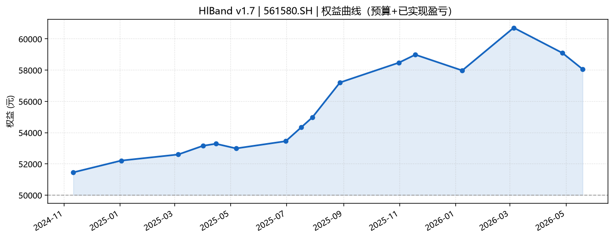
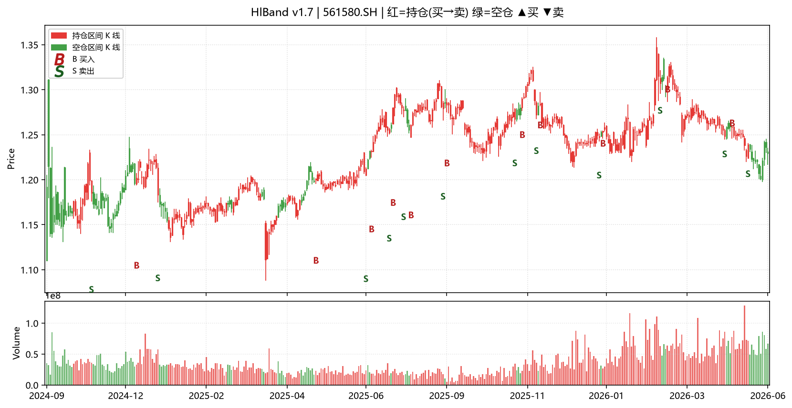

# HlBand 回测分析报告

| 项 | 内容 |
| :--- | :--- |
| 策略版本 | **v1.7** |
| 标的 | **561580.SH** |
| 主图周期 | 1d |
| 回测区间（日志 bar） | **2024-09-09 ~ 2026-07-31** |
| 单笔预算 | 50,000 元 |
| DRY_RUN | False |
| 日志来源 | `log.txt` |
| 报告日期 | 2026-08-06 |
| 生成方式 | `qmt-backtest-report` 自动生成 |

---

## 1. 结论摘要

本轮回测 **16 买 16 卖**，粗算合计盈亏约 **+8,058.96 元**（相对预算 50,000 约 **+16.1%** 累计交易毛利）。胜率 **12/16（75.0%）**，最大单笔 **+5.48%** / **-3.23%**。

工程：`buy skip`=0，`sell skip`=0；pe 粘滞=0，px 粘滞=0。

---

## 2. 回测环境与参数

```
HlBand v1.7 init 561580.SH PERIOD=1d BACKTEST=True DRY_RUN=False budget=50000.0
wMA=5/10/30 dMA=5/20/60 bias5>=6.0 stop=0.08 chase<0.05
```

---

## 3. 成交明细

盈亏按「卖出价 − 买入价」× 股数粗算，**未单独拆佣金印花税**。

| # | 开仓日 | 买点 | 买入价 | 股数 | 平仓日 | 卖点 | 卖出价 | 持仓(日) | 收益% | 盈亏(元) |
| :---: | :--- | :--- | ---: | ---: | :--- | :--- | ---: | ---: | ---: | ---: |
| 1 | 20241028 | 买点1-缩量回踩强支撑 | 1.0613 | 47100 | 20241111 | 卖点2-移动止盈回撤 | 1.0922 | 14 | +2.92 | +1458.80 |
| 2 | 20241216 | 买点1-缩量回踩强支撑 | 1.0886 | 45900 | 20250102 | 卖点2-移动止盈回撤 | 1.1050 | 17 | +1.51 | +752.63 |
| 3 | 20250110 | 买点1-缩量回踩强支撑 | 1.0522 | 47500 | 20250305 | 卖点3-时间成本智能平仓 | 1.0603 | 54 | +0.78 | +389.43 |
| 4 | 20250311 | 买点1-缩量回踩强支撑 | 1.0603 | 47100 | 20250401 | 卖点2-移动止盈回撤 | 1.0722 | 21 | +1.12 | +557.78 |
| 5 | 20250407 | 买点1-缩量回踩强支撑 | 1.0494 | 47600 | 20250415 | 周线转空强制清仓 | 1.0522 | 8 | +0.26 | +130.08 |
| 6 | 20250423 | 买点1-缩量回踩强支撑 | 1.0695 | 46700 | 20250507 | 周线转空强制清仓 | 1.0631 | 14 | -0.60 | -297.79 |
| 7 | 20250520 | 买点1-缩量回踩强支撑 | 1.0941 | 45700 | 20250630 | 卖点2-移动止盈回撤 | 1.1042 | 41 | +0.92 | +461.59 |
| 8 | 20250703 | 买点1-缩量回踩强支撑 | 1.1289 | 44200 | 20250717 | 卖点2-移动止盈回撤 | 1.1491 | 14 | +1.79 | +893.79 |
| 9 | 20250721 | 买点1-缩量回踩强支撑 | 1.1583 | 43100 | 20250729 | 卖点2-移动止盈回撤 | 1.1730 | 8 | +1.27 | +632.93 |
| 10 | 20250804 | 买点1-缩量回踩强支撑 | 1.1445 | 43600 | 20250828 | 卖点2-移动止盈回撤 | 1.1957 | 24 | +4.47 | +2229.87 |
| 11 | 20250901 | 买点1-缩量回踩强支撑 | 1.2022 | 41500 | 20251031 | 卖点3-时间成本智能平仓 | 1.2327 | 60 | +2.54 | +1267.06 |
| 12 | 20251106 | 买点1-缩量回踩强支撑 | 1.2337 | 40500 | 20251118 | 卖点2-移动止盈回撤 | 1.2464 | 12 | +1.03 | +513.07 |
| 13 | 20251120 | 买点1-缩量回踩强支撑 | 1.2444 | 40100 | 20260108 | 卖点3-时间成本智能平仓 | 1.2192 | 49 | -2.03 | -1011.10 |
| 14 | 20260112 | 买点1-缩量回踩强支撑 | 1.2241 | 40800 | 20260305 | 卖点2-移动止盈回撤 | 1.2912 | 52 | +5.48 | +2736.03 |
| 15 | 20260311 | 买点1-缩量回踩强支撑 | 1.2843 | 38900 | 20260427 | 卖点3-时间成本智能平仓 | 1.2427 | 47 | -3.23 | -1615.37 |
| 16 | 20260506 | 买点1-缩量回踩强支撑 | 1.2467 | 40100 | 20260519 | 周线转空强制清仓 | 1.2208 | 13 | -2.08 | -1039.84 |

**合计粗算盈亏：+8,058.96 元**

---

## 4. 绩效与信号分布

| 指标 | 数值 |
| :--- | :--- |
| 完整轮次 | 16 |
| 胜 / 负 | 12 / 4 |
| 胜率 | 75.0% |
| 平均单笔收益 | +1.01% |
| 最大单笔盈利 | +5.48% |
| 最大单笔亏损 | -3.23% |
| 盈利合计 / 亏损合计 | +12023 / -3964 |

### 买点分布

| 信号 | 次数 |
| :--- | :---: |
| `pullback_vol` | 16 |

### 卖点分布

| 信号 | 次数 |
| :--- | :---: |
| `trail_stop` | 9 |
| `time_force` | 4 |
| `weekly_bear` | 3 |

---

## 5. 图表

- 权益曲线：[`hlband_equity.png`](./hlband_equity.png)
- 持仓着色 K 线：[`hlband_trades_kline.png`](./hlband_trades_kline.png)
- 成交 CSV：[`hlband_trades.csv`](./hlband_trades.csv)





---

## 6. 附录

- 原始日志：[`../log.txt`](../log.txt)
- 统计 JSON：[`hlband_report_stats.json`](./hlband_report_stats.json)
- 深度解读（可选）：同目录下人工笔记如 `r1.md`

*本报告由 qmt-backtest-report 自动生成，仅供策略研发对照，不构成投资建议。*
