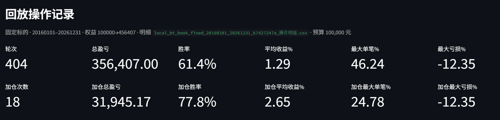

BOOK_STOCKS = {
    "600938.SH": {"ma_type": "SMA", "dividend_type": "front"},
    "603259.SH": {"ma_type": "EMA", "dividend_type": "front"},
    "601615.SH": {"ma_type": "EMA", "dividend_type": "front_ratio"},
    "002142.SZ": {"ma_type": "EMA", "dividend_type": "front_ratio"},
    "000858.SZ": {"ma_type": "EMA", "dividend_type": "front_ratio"},
    "600025.SH": {"ma_type": "EMA", "dividend_type": "front_ratio"},
}

BOOK_STOCKS = {
    "600938.SH": {"ma_type": "SMA", "dividend_type": "front"},
    "603259.SH": {"ma_type": "EMA", "dividend_type": "front"},
    "601615.SH": {"ma_type": "EMA", "dividend_type": "front_ratio"},
    "600009.SH": {"ma_type": "SMA", "dividend_type": "front_ratio"},
    "000858.SZ": {"ma_type": "EMA", "dividend_type": "front_ratio"},
    "600025.SH": {"ma_type": "EMA", "dividend_type": "front_ratio"},
}

BOOK_STOCKS = {
    "600938.SH": {"ma_type": "SMA", "dividend_type": "front"},
    "603259.SH": {"ma_type": "EMA", "dividend_type": "front"},
    "002601.SZ": {"ma_type": "SMA", "dividend_type": "front_ratio"},
    "601995.SH": {"ma_type": "EMA", "dividend_type": "front"},
    "600025.SH": {"ma_type": "EMA", "dividend_type": "front_ratio"},
    "000708.SZ": {"ma_type": "SMA", "dividend_type": "front_ratio"},
}

BOOK_STOCKS = {
"600938.SH": {"ma_type": "EMA", "dividend_type": "front_ratio"},
"603259.SH": {"ma_type": "EMA", "dividend_type": "front_ratio"},
"601615.SH": {"ma_type": "EMA", "dividend_type": "front_ratio"},
"603659.SH": {"ma_type": "EMA", "dividend_type": "front_ratio"},
"002001.SZ": {"ma_type": "EMA", "dividend_type": "front_ratio"}, 
"600350.SH": {"ma_type": "EMA", "dividend_type": "front_ratio"}, 
"601857.SH": {"ma_type": "EMA", "dividend_type": "front_ratio"}, 
}
