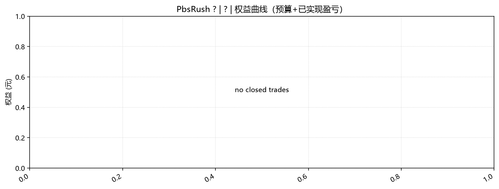

# PbsRush 回测分析报告

| 项 | 内容 |
| :--- | :--- |
| 策略版本 | **?** |
| 标的 | **?** |
| 主图周期 | ? |
| 回测区间（日志 bar） | **2026-08-12 ~ 2026-08-12** |
| 单笔预算 | 0 元 |
| DRY_RUN | ? |
| 日志来源 | `log.txt`（信号标签） |
| 盈亏真源 | log 自记账（回退） |
| 报告日期 | 2026-08-12 |
| 生成方式 | `qmt-backtest-report` 自动生成 |

---

## 1. 结论摘要

本轮回测 **0 买 0 卖**，合计盈亏约 **+0.00 元**（相对预算 0 约 **+0.0%** 累计交易毛利）。胜率 **0/0（0.0%）**，最大单笔 **+0.00%** / **+0.00%**。

工程：`buy skip`=0，`sell skip`=0；pe 粘滞=0，px 粘滞=0。

---

## 2. 回测环境与参数

```
PbsRush ? init ? PERIOD=? BACKTEST=? DRY_RUN=? budget=0.0
wMA=None dMA=None bias5>=None stop=None chase<None
```

---

## 3. 成交明细

未找到终端操作明细，盈亏回退为 log 自记账价（多为前复权开盘），**可能与终端结算不一致**。建议导出 `QMT终端操作明细.csv` 至 `report/` 后重跑。

| # | 开仓日 | 买点 | 买入价 | 股数 | 平仓日 | 卖点 | 卖出价 | 持仓(日) | 收益% | 盈亏(元) |
| :---: | :--- | :--- | ---: | ---: | :--- | :--- | ---: | ---: | ---: | ---: |

**合计盈亏：+0.00 元**

---

## 4. 绩效与信号分布

| 指标 | 数值 |
| :--- | :--- |
| 完整轮次 | 0 |
| 胜 / 负 | 0 / 0 |
| 胜率 | 0.0% |
| 平均单笔收益 | +0.00% |
| 最大单笔盈利 | +0.00% |
| 最大单笔亏损 | +0.00% |
| 盈利合计 / 亏损合计 | +0 / +0 |

### 买点分布

| 信号 | 次数 |
| :--- | :---: |

### 卖点分布

| 信号 | 次数 |
| :--- | :---: |

---

## 5. 图表

- 权益曲线：[`pbsrush_equity.png`](./pbsrush_equity.png)
- 持仓着色 K 线：[`pbsrush_trades_kline.png`](./pbsrush_trades_kline.png)
- 成交 CSV：[`pbsrush_trades.csv`](./pbsrush_trades.csv)




---

## 6. 附录

- 原始日志：[`../log.txt`](../log.txt)
- 统计 JSON：[`pbsrush_report_stats.json`](./pbsrush_report_stats.json)
- 深度解读（可选）：同目录下人工笔记如 `r1.md`

*本报告由 qmt-backtest-report 自动生成，仅供策略研发对照，不构成投资建议。*
