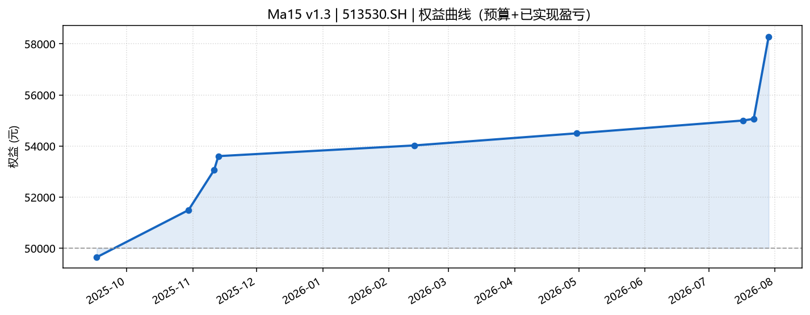

# Ma15 回测分析报告

| 项 | 内容 |
| :--- | :--- |
| 策略版本 | **v1.3** |
| 标的 | **513530.SH** |
| 主图周期 | 15m |
| 回测区间（日志 bar） | **2025-08-22 ~ 2026-08-14** |
| 单笔预算 | 50,000 元 |
| DRY_RUN | False |
| 日志来源 | `log.txt`（信号标签） |
| 盈亏真源 | **终端操作明细** `QMT终端操作明细.csv` |
| 报告日期 | 2026-08-17 |
| 生成方式 | `qmt-backtest-report` 自动生成 |

---

## 1. 结论摘要

本轮回测 **9 买 9 卖**，合计盈亏约 **+8,284.20 元**（相对预算 50,000 约 **+16.6%** 累计交易毛利）。胜率 **8/9（88.9%）**，最大单笔 **+3.14%** / **-0.69%**。

工程：`buy skip`=0，`sell skip`=0；pe 粘滞=2，px 粘滞=0。

---

## 2. 回测环境与参数

```
Ma15 v1.3 init 513530.SH PERIOD=15m BACKTEST=True DRY_RUN=False budget=50000.0
wMA=None dMA=None bias5>=None stop=None chase<None
```

---

## 3. 成交明细

盈亏/成交价以 **QMT 终端操作明细** 为真源（引擎 `passorder` 结算）；买卖信号标签来自 log。终端「盈利」字段优先，否则用（卖价−买价）×股数。

| # | 开仓日 | 买点 | 买入价 | 股数 | 平仓日 | 卖点 | 卖出价 | 持仓(日) | 收益% | 盈亏(元) |
| :---: | :--- | :--- | ---: | ---: | :--- | :--- | ---: | ---: | ---: | ---: |
| 1 | 20250912 | 长脚十字/假阴护盘 | 1.5960 | 32000 | 20250917 | 贴线动能衰竭 | 1.5850 | 5 | -0.69 | -352.00 |
| 2 | 20251020 | 回踩收阳 | 1.5874 | 64500 | 20251030 | 收盘最高回吐 | 1.6160 | 10 | +1.80 | +1844.50 |
| 3 | 20251105 | 回踩收阳 | 1.6617 | 61800 | 20251111 | 收盘最高回吐 | 1.6870 | 6 | +1.52 | +1564.20 |
| 4 | 20251111 | 回踩收阳 | 1.6870 | 30400 | 20251113 | 收盘最高回吐 | 1.7050 | 2 | +1.07 | +547.20 |
| 5 | 20260206 | 长脚十字/假阴护盘 | 1.6064 | 63700 | 20260213 | 收盘最高回吐 | 1.6130 | 7 | +0.41 | +419.30 |
| 6 | 20260409 | 回踩收阳 | 1.6180 | 31600 | 20260430 | 收盘最高回吐 | 1.6330 | 21 | +0.93 | +474.00 |
| 7 | 20260710 | 回踩收阳 | 1.5007 | 68400 | 20260717 | 收盘最高回吐 | 1.5080 | 7 | +0.49 | +500.80 |
| 8 | 20260721 | 长脚十字/假阴护盘 | 1.5490 | 33100 | 20260722 | 贴线动能衰竭 | 1.5510 | 1 | +0.13 | +66.20 |
| 9 | 20260722 | 放量反包 | 1.5678 | 65500 | 20260729 | 浮盈止盈 | 1.6170 | 7 | +3.14 | +3220.00 |

**合计盈亏：+8,284.20 元**

---

## 4. 绩效与信号分布

| 指标 | 数值 |
| :--- | :--- |
| 完整轮次 | 9 |
| 胜 / 负 | 8 / 1 |
| 胜率 | 88.9% |
| 平均单笔收益 | +0.98% |
| 最大单笔盈利 | +3.14% |
| 最大单笔亏损 | -0.69% |
| 盈利合计 / 亏损合计 | +8636 / -352 |

### 买点分布

| 信号 | 次数 |
| :--- | :---: |
| `hammer` | 3 |
| `bounce` | 5 |
| `engulf` | 1 |

### 卖点分布

| 信号 | 次数 |
| :--- | :---: |
| `stall` | 2 |
| `giveback` | 6 |
| `take_profit` | 1 |

---

## 5. 图表

- 权益曲线：[`ma15_equity.png`](./ma15_equity.png)
- 持仓着色 K 线：[`ma15_trades_kline.png`](./ma15_trades_kline.png)
- 成交 CSV：[`ma15_trades.csv`](./ma15_trades.csv)




---

## 6. 附录

- 原始日志：[`../log.txt`](../log.txt)
- 终端操作明细：[`QMT终端操作明细.csv`](./QMT终端操作明细.csv)
- 统计 JSON：[`ma15_report_stats.json`](./ma15_report_stats.json)
- 深度解读（可选）：同目录下人工笔记如 `r1.md`

*本报告由 qmt-backtest-report 自动生成，仅供策略研发对照，不构成投资建议。*
